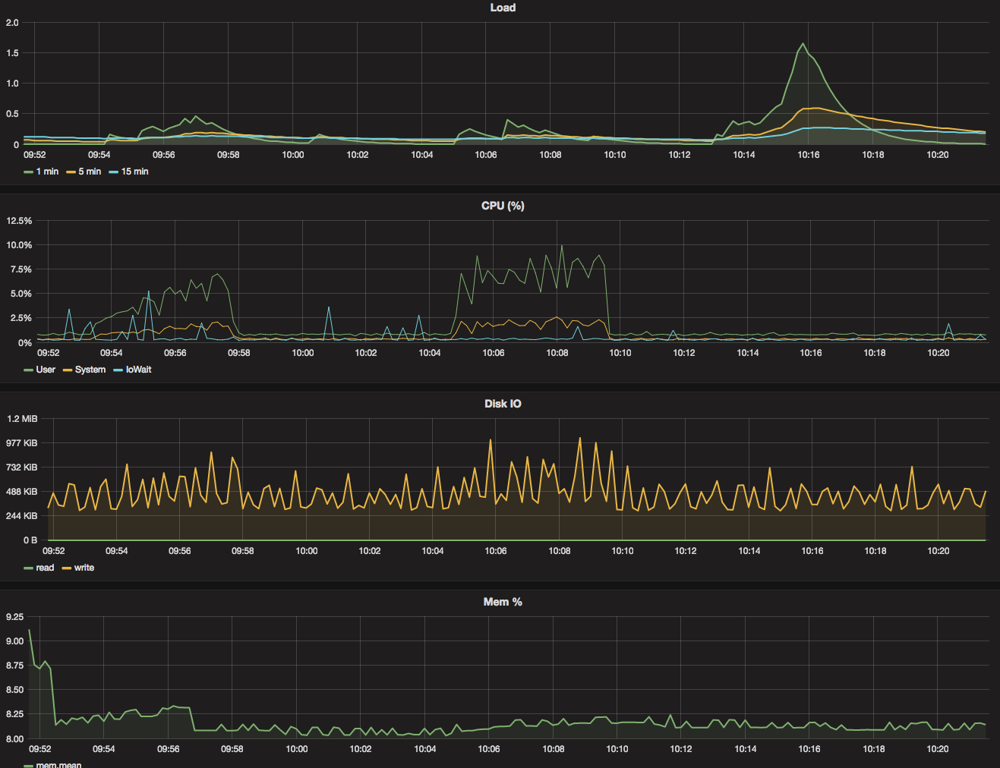

# Run parameters

* apid version: 0.0.13
* aws machine: m4.large
* mockServer params: `-numDeps=100 -numDevs=50000 -addDevEach=3s -upDevEach=1s -upDepEach=3s`
* artillery scenario: [users.yaml](users.yaml)

# Results

* Artillery report: [artillery_report_20170301_100486.json](artillery_report_20170301_100486.json)
* Influxdb: [telegraf.autogen.00002.00](telegraf.autogen.00002.00)

