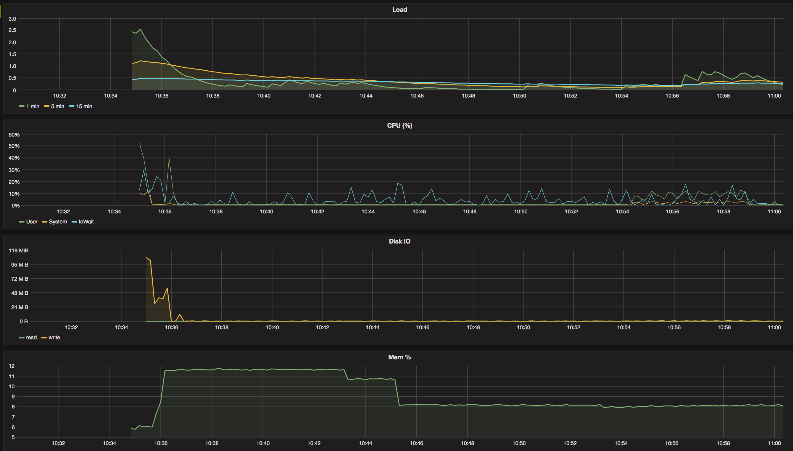

# Run parameters

* apid version: 0.0.18
* aws machine: m4.large
* mockServer params: `-numDeps=100 -numDevs=50000 -addDevEach=3s -upDevEach=1s -upDepEach=3s`
* artillery scenario: [users.yaml](users.yaml)

apid config:
 ```
api_listen: :9000    # note: leave api open for connections from anywhere
api_expvar_path: /expvar
events_buffer_size: 5
apigeesync_proxy_server_base: http://localhost:9001
apigeesync_snapshot_server_base: http://localhost:9001
apigeesync_change_server_base: http://localhost:9001
apidanalytics_uap_server_base: http://localhost:9001
apigeesync_consumer_key: key
apigeesync_consumer_secret: secret
apigeesync_cluster_id: cluster
log_level: info
data_trace_log_level: info
data_source: file:%s?_busy_timeout=20000
local_storage_path: /demo/data
```

# Results

* Artillery report: [artillery_report_20170309_105437.json](artillery_report_20170309_105437.json)
* Influxdb: [telegraf.autogen.00002.00](telegraf.autogen.00002.00)

### Summary
```
    "scenariosCreated": 40831,
    "scenariosCompleted": 40440,
    "requestsCompleted": 81017,
    "latency": {
      "min": 82.8,
      "max": 9653.9,
      "median": 450.8,
      "p95": 4565.9,
      "p99": 6544.9
    },
    "rps": {
      "count": 81408,
      "mean": 288.27
    },
    "scenarioDuration": {
      "min": 190.1,
      "max": 14257.9,
      "median": 998.1,
      "p95": 7447.2,
      "p99": 11248.6
    },
    "scenarioCounts": {
      "Verified user": 36695,
      "Unverified user": 4136
    },
    "errors": {
      "ETIMEDOUT": 391,
      "ESOCKETTIMEDOUT": 21
    },
    "codes": {
      "200": 81017
    },
```

### Influx Dashboard

